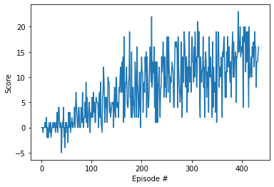

# Project 1: Navigation
## Learning Algorithm
This project uses a double Deep Q learning agent using a dueling network.
### Deep Q learning
Deep Q learning was introduced in [this paper](https://storage.googleapis.com/deepmind-media/dqn/DQNNaturePaper.pdf)
Deep  Q learning uses two neural networks (with identical architecture)  to estimate the state-action value Q, an local network and a target network.  
The algoritm works a follows:

    1. Initialize local network, and target network (copying the weights from the local network)
    2. Initialize a replay buffer
    For each episode do:
        3. initialize environment
        for each timestep do:
            4. Choose an action for the current state using  an epsilon greedy policy and the local Q-network
            5. Take the action and observer the next state and reward
            6. Store the State, Action, reward, next state in the replay buffer
            If there are enough experiences in the replay buffer then train the target network:
                7. Select a random mini batch of experiences from the replay buffer
                8. Set the expected Q value to the reward + the discount rate  * the Q value (from the target network) for the best action available to the next state
                9. Step the local network optimizer to bring the Q value closer to the expected Q value
                10. Every N steps perform a soft update to bring the Target network weights closer to the local network weights
                
### Double Q Learning
Double deep Q learning was introduced in [this paper](https://arxiv.org/pdf/1509.06461.pdf)
Q learning is prone to oversetimate the Q values.  
Double Q learning reduces this by chosing the best action for the next state in step 8 above from the local network, but using the extimated value for that action from the target network.

### Dueling Network
The Dueling Network architecture was introduced in  [this paper](https://arxiv.org/pdf/1511.06581.pdf)
Rather than using a single feed forward neural network to estimate the Q value (for both the target and local networks),
dueling newtworks use 2 feed forward neural networks one to estimate the value of the state, and another to estimate the advantage of eache action at that state, such that the total Q value for an action and state is state_value + state_action_advantage_value.  The state_value and state_action_advantage_value are never estimated directly, only the Q value obained by their sum.  This means that the same value could be added to the state_value, and subtracted from the state_action_advantage_value without changing the Q value.  Taking advantage of this we modify the Q value to be state_value + state_action_advantage_value - the average of all state_action_advantage_values at this state, which improves the stability of the nework.

### Network Architecture
The state_value network used here is:
64 Fully Connected units with relu activation
64 Fully Connected units with relu activation
1 Fully Connected unit

The state_value network used here is:
64 Fully Connected units with relu activation
64 Fully Connected units with relu activation
Action Size (here 4) fully connected units

### Hyperparameters
I use the Following hyperparameters:
Epsilon Start value eps_start = 1.0
Epislon minimum value eps_end = 0.01,
Epsilon decay rate eps_decay=0.98

replay buffer size BUFFER_SIZE = int(1e5) 
minibatch size BATCH_SIZE = 64
discount factor GAMMA = 0.99
soft update of target parameters TAU = 1e-3
learning rate  LR = 5e-4
how often to update the network UPDATE_EVERY = 4

### Results
This agent was able to solve the envronment in 335 epsodes with an average score of 13.04
Below is a plot of the score for each episode

### Future Work
There are a couple of ways this project could be extended.  The first is to use a prioritized experience replay buffer, which placed greater priority on experiences that have a greater discrepency with the expected Q value, to ensure that the network trains on the most useful experiences.
Another possiblility for extending the project is to use a modified version of the environment which presents the state as an image rather than a vector of parameters.  To learn from such an environment a convolutional neural network would be placed above the network for extimating Q values.  The state value and action advantage networks could share the same convolutional network.